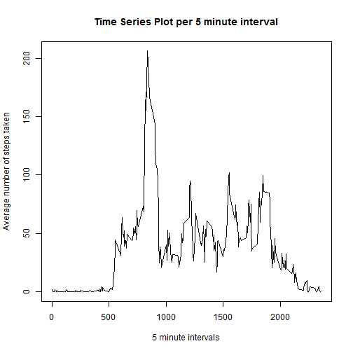
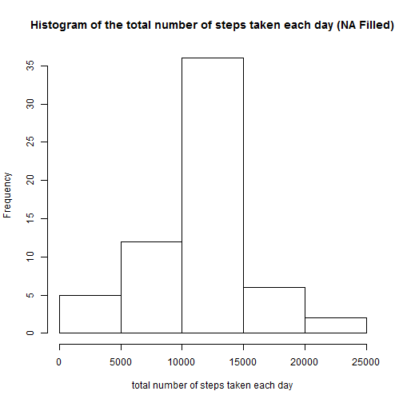
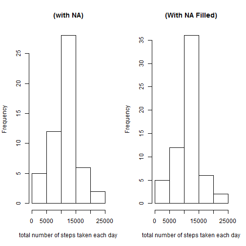

Reproducible Research: Peer Assessment 1
========================================================


Loading and preprocessing the data
-------------------------
Make sure that the `activity.csv` is present in the same folder as `PA1_template.Rmd`. 

### Load the data

```r
activity <- read.csv("activity.csv")
```

### Preprocess the data

```r
activity$date <- as.Date(activity$date , format = "%Y-%m-%d") 

# create dataframe with total steps per day
activity.day <- aggregate(activity$steps, by=list(activity$date), sum)
names(activity.day)[1] <-"day"
names(activity.day)[2] <-"steps"

# create dataframe with total steps per interval
activity.interval <- aggregate(activity$steps, by=list(activity$interval), sum, na.rm=TRUE, na.action=NULL)
names(activity.interval)[1] <-"interval"
names(activity.interval)[2] <-"steps"

# create dataframe with mean steps per interval
activity.mean.interval <- aggregate(activity$steps, by=list(activity$interval), mean, na.rm=TRUE, na.action=NULL)
names(activity.mean.interval)[1] <-"interval"
names(activity.mean.interval)[2] <-"mean.steps"
```

### Histogram of the total number of steps taken each day

```r
hist(activity.day$steps, main = "Histogram of the total number of steps taken each day",xlab = "total number of steps taken each day")
```

 

### The mean and median total number of steps taken per day
Mean number of steps per day:

```r
mean(activity.day$steps, na.rm = TRUE)
```

```
## [1] 10766
```
Median number of steps per day:

```r
median(activity.day$steps, na.rm = TRUE )
```

```
## [1] 10765
```

Average daily activity pattern?
-------------------------

### Plotting Time Series

```r
plot(activity.mean.interval$interval, activity.mean.interval$mean.steps, type="n", 
     main="Time Series Plot per 5 minute interval",
     xlab = "5 minute intervals",
     ylab = "Average number of steps taken") 
lines(activity.mean.interval$interval, activity.mean.interval$mean.steps,type="l") 
```

 

### Maximum number of steps

```r
activity.mean.interval[which.max(activity.mean.interval$mean.steps),1]
```

```
## [1] 835
```

Missing values
-------------------------

### Missing values
Total number of missing values in the dataset:

```r
sum(is.na(activity$steps))
```

```
## [1] 2304
```

### Fill in missing values

```r
activity.missing <- merge(activity, activity.mean.interval, by = "interval", sort= FALSE) 
activity.missing <- activity.missing[with(activity.missing, order(date,interval)), ] 
# Replace steps column NAs with value in mean.steps column
activity.missing$steps[is.na(activity.missing$steps)] <- activity.missing$mean.steps[is.na(activity.missing$steps)] 
activity.missing$mean.steps <- NULL 
```
Fix the Dataset to round off fractions for the number of steps:

```r
head(activity.missing)
```

```
##     interval   steps       date
## 1          0 1.71698 2012-10-01
## 63         5 0.33962 2012-10-01
## 128       10 0.13208 2012-10-01
## 205       15 0.15094 2012-10-01
## 264       20 0.07547 2012-10-01
## 327       25 2.09434 2012-10-01
```

```r
activity.missing$steps <- round(activity.missing$steps, digits = 0)
```

### New dataset with missing data filled in

```r
activity.new <- activity.missing[, c(2,3,1)]
```

### Histogram of total number of steps

```r
activity.day.new <- aggregate(activity.new$steps, by=list(activity.new$date), sum)
names(activity.day.new)[1] <-"day"
names(activity.day.new)[2] <-"steps"
```

### Histogram of the total number of steps taken each day


```r
hist(activity.day.new$steps, 
     main = "Histogram of the total number of steps taken each day (NA Filled)",
     xlab = "total number of steps taken each day")
```

 

### The mean and median total number of steps taken per day

Mean number of steps per day:

```r
mean(activity.day.new$steps, na.rm = TRUE)
```

```
## [1] 10766
```
Median number of steps per day:

```r
median(activity.day.new$steps, na.rm = TRUE )
```

```
## [1] 10762
```
Comparitive plot (With and With NAs Filled)


```r
par(mfrow=c(1,2))

hist(activity.day$steps, 
     main = "(with NA)",
     xlab = "total number of steps taken each day")

hist(activity.day.new$steps, 
     main = "(With NA Filled)",
     xlab = "total number of steps taken each day")
```

 

### Estimates of the total daily number of steps


```r
activity.new.2 <- activity.new

Sys.setlocale("LC_TIME", "English")
```

```
## [1] "English_United States.1252"
```

```r
activity.new.2$weekdays <- factor(format(activity.new.2$date,'%A'))

levels(activity.new.2$weekdays)
```

```
## [1] "Friday"    "Monday"    "Saturday"  "Sunday"    "Thursday"  "Tuesday"  
## [7] "Wednesday"
```

```r
levels(activity.new.2$weekdays) <- list("weekday" = c("Monday", "Tuesday", "Wednesday", "Thursday", "Friday"), "weekend" = c("Saturday", "Sunday"))
```

### panel plot

```r
activity.new.2.mean.interval <- aggregate(activity.new.2$steps, by=list(activity.new.2$weekdays, activity.new.2$interval), mean, na.rm=TRUE, na.action=NULL)
names(activity.new.2.mean.interval)[1] <-"weekday"
names(activity.new.2.mean.interval)[2] <-"interval"
names(activity.new.2.mean.interval)[3] <-"mean.steps"

library(lattice) 
xyplot(activity.new.2.mean.interval$mean.steps ~ activity.new.2.mean.interval$interval | activity.new.2.mean.interval$weekday, 
       layout=c(1,2), 
       type="l",
       xlab = "Interval",
       ylab = "Number of steps")
```

 
